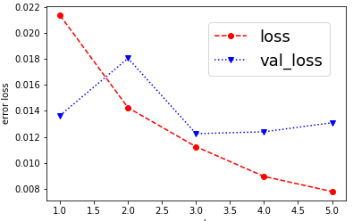

# Behavioral Cloning

## Rubric Points
### Here I will consider the [rubric points](https://review.udacity.com/#!/rubrics/432/view) individually and describe how I addressed each point in my implementation.  

---
### Files Submitted & Code Quality

#### 1. Submission includes all required files and can be used to run the simulator in autonomous mode

My project includes the following files:
* create_traning_data.py containing the script to create and train the model
* drive.py for driving the car in autonomous mode
* model.h5 containing a trained convolution neural network 
* writeup.md summarizing the results

#### 2. Submission includes functional code
Using the Udacity provided simulator and my drive.py file, the car can be driven autonomously around the track by executing 
```sh
python drive.py model.h5
```

#### 3. Submission code is usable and readable

The create_traning_data.py file contains the code for training and saving the convolution neural network. The file shows the pipeline I used for training and validating the model, and it contains comments to explain how the code works.

### Model Architecture and Training Strategy

#### 1. An appropriate model architecture has been employed

I decided to try [the nVidia Network Architecture model](https://developer.nvidia.com/blog/deep-learning-self-driving-cars/).  

```
_________________________________________________________________
Layer (type)                 Output Shape              Param #
=================================================================
lambda_1 (Lambda)            (None, 160, 320, 3)       0
_________________________________________________________________
cropping2d_1 (Cropping2D)    (None, 75, 320, 3)        0
_________________________________________________________________
conv2d_1 (Conv2D)            (None, 36, 158, 24)       1824
_________________________________________________________________
conv2d_2 (Conv2D)            (None, 16, 77, 36)        21636
_________________________________________________________________
conv2d_3 (Conv2D)            (None, 6, 37, 48)         43248
_________________________________________________________________
conv2d_4 (Conv2D)            (None, 4, 35, 64)         27712
_________________________________________________________________
conv2d_5 (Conv2D)            (None, 2, 33, 64)         36928
_________________________________________________________________
flatten_1 (Flatten)          (None, 4224)              0
_________________________________________________________________
dense_1 (Dense)              (None, 100)               422500
_________________________________________________________________
dense_2 (Dense)              (None, 50)                5050
_________________________________________________________________
dense_3 (Dense)              (None, 10)                510
_________________________________________________________________
dense_4 (Dense)              (None, 1)                 11
=================================================================
Total params: 559,419
Trainable params: 559,419
Non-trainable params: 0
_________________________________________________________________
```

#### 2. Attempts to reduce overfitting in the model

The model has shuffle enabled and epochs count adjusted to reduce overfitting.I've inserted Dropout and Batch Normalization into several layers, but it's harder to get the trajectory I expect.

#### 3. Model parameter tuning

The model used an adam optimizer, so the learning rate was not tuned manually (model.py line 25).

#### 4. Appropriate training data

The training data was selected to keep the vehicle on the road. We trained in the case of forward running, reverse running, and returning when deviated from the center. The simulator provides three different images of the center, left and right cameras. Each image was used to train the model.

See the next section for more information on how to create training data. 

### Model Architecture and Training Strategy

#### 1. Solution Design Approach

All training was conducted on my Desktop PC.
It was essential to work with the Udacity simulator, which made me think again about the version of the library.
I started by training LeNet in Keras to see how it works.
Next, I decided to extend my training dataset by adding and using images from the left and right cameras and a left-right inverted version of the image from the center camera.
Then I implemented a cropping layer as the first layer of the network. This removed the top 65 and bottom 20 pixels from each input image before passing the image to the convolution layer.
The removed pixels contain unwanted environmental information that is unrelated to steering and can confuse the model.
And I implemented  [the nVidia Network Architecture model](https://developer.nvidia.com/blog/deep-learning-self-driving-cars/).
I tried to include Dropout etc. in the architecture model, but I gave up because the initial stage was extremely slow due to memory problems.

#### 2. Final Model Architecture
The final model architecture will be [the nVidia Network Architecture model](https://developer.nvidia.com/blog/deep-learning-self-driving-cars/) listed above.

#### 3. Creation of the Training Set & Training Process
We made 3 laps for forward feed, 2 laps for reverse run, and several points for the course to return from the end with sharp curves and straight lines.
As a result, the number of center images alone was 11354.
Initially, the number of epochs was set to 10, but it was set to 5 because val_loss did not decrease as shown in the figure below.


